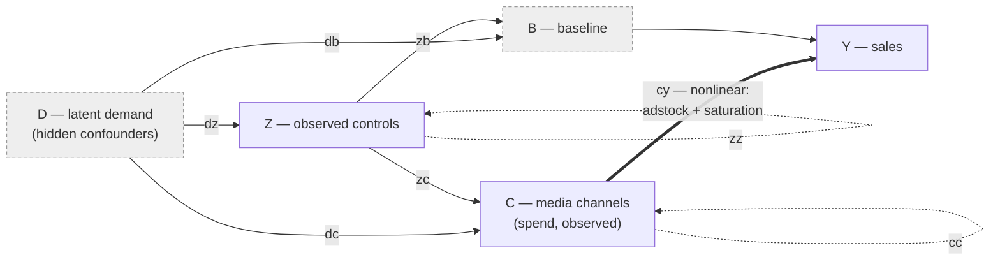

# prior-generator

Simulate thousands of synthetic marketing-mix-model (MMM) **worlds** — and get
their *exact* ground truth.

Each world is an **additive structural causal model (SCM)** over latent demand,
observed controls, media channels, a baseline, and sales. It is built as a single
**PyTensor / PyMC** graph — every prior is a PyMC distribution and every mechanism
(adstock, saturation) comes from **pymc-marketing** — so one `pm.draw` yields the
observable series *and* the exact causal decomposition of sales together,
reproducibly from a seed.

From one world you can get:

- the **observable data** a modeller would see (spend, controls, sales),
- the **exact decomposition** of sales into per-channel direct contributions,
  per-control and per-confounder baseline effects, and the telescoping indirect
  split — holding to float precision, not a Taylor approximation,
- a **plain-text description** of the world (its DAG, coefficients, mechanisms,
  and signal diagnostics),
- an **auditable dataset bundle** (CSVs + figures + description), or
- a **corpus** of many worlds in the tensor format amortized-inference / PFN
  training pipelines consume.

> **Status: v0.0.1, alpha.** Extracted from
> [`pymc-labs/structural-pfn`](https://github.com/pymc-labs/structural-pfn) and
> refactored so the SCM is a drawable PyMC model.

📖 **Documentation:** <https://pymc-labs.github.io/prior-generator/> — a MkDocs
site with docstring-driven API pages, guide pages whose plots are generated by
executing real code at build time, and a runnable
[examples notebook](https://pymc-labs.github.io/prior-generator/examples/). Source
in [`docs/`](docs/); see [CONTRIBUTING.md](CONTRIBUTING.md#documentation) to build
it locally.

## Contents

- [Install](#install)
- [Quickstart](#quickstart)
- [Foundation: the structural causal model](#foundation-the-structural-causal-model)
- [How a world is created](#how-a-world-is-created)
- [The exact decomposition](#the-exact-decomposition)
- [Outcome distributions: how large is everything?](#outcome-distributions-how-large-is-everything)
- [Data diagnostics: what depends on what?](#data-diagnostics-what-depends-on-what)
- [Assumptions and design choices](#assumptions-and-design-choices)
- [Dialing complexity](#dialing-complexity)
- [Outputs](#outputs)
- [Named audit scenarios](#named-audit-scenarios)
- [Public API](#public-api)
- [Reproducibility and validation](#reproducibility-and-validation)
- [Foundation libraries](#foundation-libraries)

## Install

The modeling stack is pinned to a validated combination — pymc-marketing is not
yet on PyPI and is pinned to an exact commit (from its `v1.0.0` line, not the
moving branch) so installs stay reproducible — so install from source:

```bash
pip install "git+https://github.com/pymc-labs/prior-generator.git"
# or, for development:
git clone https://github.com/pymc-labs/prior-generator.git
cd prior-generator
pip install -e ".[dev]"      # or: uv pip install -e ".[dev]"
```

Requires Python ≥ 3.12 (the pinned `pymc` needs it). Core dependencies:
`pytensor`, `pymc`, `pymc-marketing`, `numpy`, `scipy`, `pandas`, `matplotlib`.

## Quickstart

### Sample one world and read its story

```python
import prior_generator as pg

# A named audit scenario (isolates one causal pathway), or build your own prior.
scenario = pg.SCENARIOS[1]                        # "confounded_spend"
scm = pg.sample_scm(scenario.prior(n_time_steps=104, seed=0), seed=0,
                    connect_all=scenario.connect_all,
                    name=scenario.name, purpose=scenario.purpose)

print(pg.describe_scm(scm))          # DAG edges + coefficients, mechanisms,
                                     # decomposition identity, signal metrics
print("decomposition error:", scm.identity_error())   # ~1e-15
```

### Write an auditable bundle (CSVs + figures + description)

```python
pg.write_scm_bundle(scm, "my_world/")
# dataset.csv, true_components.csv, description.txt,
# dag.dot, dag.png, timeseries.png, decomposition.png, channels.png
```

Or generate the full five-scenario inspection set from the command line:

```bash
prior-generator --out inspection-datasets --seed 20260712
```

### Generate a corpus for training

```python
cfg = pg.make_scm_prior(n_treatments=8, n_covariates=4, n_latent=2,
                        n_cells=50, draws_per_cell=20, seed=42)
corpus = pg.sample_prior_predictive(cfg)          # dict of numpy arrays
pg.save_corpus(corpus, "corpus.npz")              # compressed, self-describing
loaded = pg.load_corpus("corpus.npz")
```

Every corpus satisfies, exactly (float64 pre-storage):

```
sales = baseline + Σ direct_contributions + indirect_effects
      = baseline_intrinsic + sales_noise + Σ confounder + Σ control + Σ direct + Σ indirect_by_source
```

## Foundation: the structural causal model

Every world is a **Pearlian additive SCM** over five families of nodes. The whole
point of the design is the distinction between what a modeller *observes* and what
*confounds* them:

| Node | Symbol | Role | Observed? | Sign |
| --- | --- | --- | --- | --- |
| Latent demand | `D₁…D_J` | Hidden confounders — the classic MMM bias source | **No** | signed |
| Controls | `Z₁…Z_M` | Observed covariates (promo calendar, price, seasonality…) | Yes | signed |
| Media channels | `C₁…C_K` | The treatments/interventions; **spend is observed** | Yes | ≥ 0 |
| Baseline | `B` | Organic demand level; always feeds sales | (latent) | signed |
| Sales | `Y` | The outcome (a sink) | Yes | ≥ 0 |

Nodes are connected by a directed acyclic graph drawn from **eight edge types**.
The type of an edge determines *where it enters* and therefore *what it does*:



| Type | Edge | Meaning | Effect on Y |
| --- | --- | --- | --- |
| `cy` | C → Y | **Direct** media response (adstock + saturation), coeff `βₖ` | direct |
| `db` | D → B | Demand lifts the baseline | direct (baseline) |
| `zb` | Z → B | Controls lift the baseline | direct (baseline) |
| `dc` | D → C | Demand drives spend — **confounds** attribution | indirect |
| `zc` | Z → C | Controls drive spend (e.g. promo triggers media) | indirect |
| `cc` | C → C | Channel **halo** (upstream channels amplify downstream) | indirect |
| `dz` | D → Z | Demand moves the controls | via Z (baseline and/or `zc`) |
| `zz` | Z → Z | Control chains | via Z (baseline and/or `zc`) |

The structural equations (`t` indexes weeks; each term is gated by whether the
corresponding edge exists in the drawn DAG):

```text
D_j = RW_j                                                  (confounder — a random walk)
F_m = RW_m + s_m·η_tm + c_m·(h_tm − q_m),  h_tm ~ Bernoulli(q_m)  (control's own drive)
Z_m = Σ_j u_jm·D_j + Σ_{m'<m} γ_{m'm}·Z_{m'} + F_m          (control)
E_k = RW_k + σ_k·ε_tk + a_k·b_tk,  b_tk ~ Bernoulli(p_k)    (channel's own exogenous drive)
C_k = softplus( Σ_j w_jk·D_j + Σ_m v_mk·Z_m
                + Σ_{k'<k} α_{k'k}·C_{k'} + E_k )            (channel spend — non-negative)
B   = max(RW_B, baseline_floor)                             (intercept — floored, ≥ floor)
Y   = B + Σ_j δ_j·D_j + Σ_m ρ_m·Z_m
          + Σ_k g_cy·β_k·f_k(C_k) + RW_Y                     (sales)
```

Three structural facts do the heavy lifting:

1. **Only the direct `C → Y` path is nonlinear.** `f_k` is that channel's
   adstock ⊙ saturation response. **Every other loading is additive and linear
   on the child's pre-activation scale** — all the input→input interactions
   (`dc, zc, cc, dz, zz`) and the baseline drivers (`db, zb`) are plain linear
   coefficients inside the parenthesis. For `B`, `Z` and `Y` there is no
   parenthesis, so those edges are linear on the *observed* scale too. A
   channel is the exception: `C_k = softplus(...)`, so the observed
   parent→channel mapping inherits the softplus curvature (and the held-level
   clamp, when shocks are enabled). With a `dc` loading of `0.308286074`
   (mid-range for the default `dc_coeff_range=(0.1, 0.5)`) and no other parent,
   `D_j = −1, 0, +1` gives `C = 0.5508, 0.6931, 0.8591`: the two equal parent
   steps produce effects of `0.1423` and `0.1660`, not one constant `0.3083`.
   Interaction *structure* is rich, interaction *shape* is linear — but only
   before the positivity guard.
2. **Every node except `Y` carries its own random-walk noise term**, and
   channels and controls additionally carry high-frequency drive. `Y` is not a
   walk: `RW_Y = rw_y_std · eps_y` is **iid** Gaussian observation noise, with
   no cumulative sum, no smoothing and no centring, and it is persisted as the
   `sales_noise` column. For channels — iid weekly
   execution noise `σ_k·ε` and campaign pulses `a_k·b` (a Bernoulli fire) —
   that variation is what makes spend *sweep* its response curve; without it,
   the contribution targets degenerate to flat lines. For controls the same two
   terms (`s_m·η`, `c_m·(h − q_m)`) exist for a different reason: a
   smooth-walk-only control occupies the same function space as the smooth
   baseline walk, which leaves `Z → B` weakly identified against baseline
   drift. The control pulse is **centred** on its own fire probability, so both
   added terms are mean-zero and a control's expected level stays `rw_z_mean`
   (i.e. `E[F_m − RW_m] = 0`) — exactly, since a control applies no
   activation. Control
   magnitudes are drawn relative to the control's own walk std; channel
   magnitudes relative to the channel's level.

   The signed `D` / `Z` / `B` walks are **centred, smoothed Gaussian paths** —
   cumulative sum, then an edge-padded moving average, then full-path centring,
   then a fixed scale divisor. A channel's own drive is the *positive-only*
   version of the same construction: the identical signed path, wrapped in
   `softplus`.
3. **The intercept is separate, and may be floored.** `B` carries no parents:
   latent demand and the controls enter `Y` *directly*, so `Y` reads as the
   equation a standard MMM assumes — intercept + linear controls + nonlinear
   media + noise — and `B` is reported on its own as `baseline_intrinsic`, with
   the observation noise in its own `sales_noise` column. `baseline_floor`
   censors that intercept (`max(RW_B, floor)`), so it is `≥ floor` by
   construction and may sit exactly *at* it. Keeping the parents outside `B` is
   what makes the floor safe: it clips one additive term, leaving
   `control_contribution[:, m] = g_zb[m]·ρ[m]·Z[:, m]` exact.

   **Sales is never censored, and cannot be strictly guaranteed.** With
   `baseline_floor_scope="non_media"` the floor clips the *running* non-media
   total as each parent joins, so a negative `ρ·Z` is credited only down to the
   floor and the excess is absorbed — every term of the sales **mean** is then
   `≥ 0`. What remains is the symmetric observation noise `RW_Y`, so `P(Y<0)>0`
   for any additive-Gaussian outcome: that is the likelihood's property, not the
   generator's. Clamping `Y` would censor the observation and break every
   additive estimator, so non-negativity is enforced by the
   [realism filter](#the-realism-filter) — with the sales mean measured at 88
   noise-σ above zero under the absorbing scope.

## How a world is created

A world is drawn in **two stages** — structure first (concrete, with numpy), then
parameters and noise (as a PyMC model). This mirrors the design principle:
*discrete structure is drawn per world; continuous priors are distributions.*

### Stage 1 — draw the structure (concrete)

`sample_g_additive` + `sample_structure` draw everything that fixes the graph's
*shape*:

- **Active sizes** — how many channels / controls / demand factors are live this
  task (drawn from the `*_active_range`s; inactive slots are zero-padded and
  masked, so tensor shapes stay fixed).
- **The DAG** `g` — which of the 8 edge types connect which nodes. Each type is
  either drawn **per-pair Bernoulli** at its base rate, or scattered from a
  per-type **arrow budget** (a "pot" — see [edge budgets](#interactions-the-edge-budget)).
  `cc` and `zz` are restricted to the **strict upper triangle** (`src < dst`),
  which guarantees acyclicity.
- **Per-channel mechanisms** — each channel's adstock family
  (`none / geometric / weibull`) and saturation family
  (`none / hill / logistic / michaelis_menten / tanh / root`), drawn from the
  family-probability simplexes.
- **Per-node walk smoothness** — a Beta prior. (The channel texture-*enable*
  flags are not drawn; they are fixed by whether the config's texture ranges are
  non-zero.)

In the **single-world** path (`sample_scm`), the DAG is resampled until it
satisfies a connectivity rule: **dead-end nodes (edges that never reach Y) are
never allowed**, and fully-isolated null nodes are permitted (as deliberate
zero-attribution traps) unless `connect_all=True`. The **corpus** path
(`sample_prior_predictive`) draws each cell's structure once, *without* this
filter — training tasks may contain dead-end or isolated nodes as they fall out of
the base rates and budgets.

### Stage 2 — draw parameters and noise (a PyMC model)

`build_world_model` assembles one `pm.Model` for that fixed structure in which
**every continuous quantity is a random variable**:

- **Edge coefficients** — `pm.Uniform` over the per-edge-type coefficient ranges
  (`w_dc`, `v_zc`, `α_cc`, `β`, …).
- **Random walks** — `pm.Uniform`/`pm.HalfNormal` means and stds, `pm.Normal`
  innovations; smoothness maps through `rw_smoothness_max_weeks` to an
  absolute-week moving-average kernel.
- **Mechanism shapes** — adstock decay / Weibull shape and the saturation shape
  priors (`SATURATION_PRIOR_RANGES`).
- **Channel texture** — weekly-jitter `pm.Normal` and campaign-pulse
  `pm.Bernoulli`, with magnitudes scaled relative to each channel's own level.
- **Control texture** — the same pair for controls (`control_hf_sigma`,
  `control_pulse_amp`, `control_pulse_prob`), with magnitudes scaled relative
  to each control's own walk std and the pulse centred on its fire
  probability. Both are inert on a raw `SCMPrior` — no graph term, no RNG
  consumed, byte-identical corpora — and enabled by
  `make_scm_prior`.

Persisted `param_rw_*_std` labels declare a walk's **expected standard
deviation** over the full simulated horizon `n_time_steps + adstock_burn_in`.
The guarantee is precisely

```text
E[ var_pop(path) ] = std²      i.e.   std = sqrt( E[var_pop(path)] )
```

and *not* `E[sd(path)] = std`. Those differ: `sqrt` is concave, so the expected
*sd* sits strictly below the declared `std` even though the expected
*variance* is exactly right. Measured over 20 000 unit-`std` paths at
`n_time_steps=60`, `E[var_pop]/std²` was 0.990–1.004 (target 1.0) while
`E[sd]/std` was 0.9220 at kernel width 1 and 0.8674 at width 26 — the
second-moment calibration is exact, the first-moment one is not, and it never
was meant to be. Each path is divided by a fixed constant rather than by its own
realized sd, so the scale is realized only in expectation: the label is neither
the realized sd of an individual path nor an sd measured only over the reported
window. `smoothness`
likewise maps to an absolute moving-average kernel width in weeks, governed by
`rw_smoothness_max_weeks` (26 by default) and clamped to that full horizon. For
positive-only channel walks, `param_rw_c_std` is the pre-softplus amplitude,
so it is excluded from the signed-walk table below rather than reported with a
misleadingly wide range.

Across 32 signed walks from eight worlds at `n_time_steps=52` and
`adstock_burn_in=8`, the reported-window sd / declared `std` was:

| signed group | reported-window sd / declared `std` | median |
| --- | --- | --- |
| `rw_d` | [0.396, 0.927] | 0.690 |
| `rw_z` | [0.252, 1.985] | 0.868 |
| `rw_b` | [0.264, 1.809] | 0.814 |

Combined, those 32 walks span [0.25, 1.99] — roughly an 8× spread.
`param_rw_*_std` is therefore a weak label for
anything measured on the reported window; consumers should not score it as if
it were the realized reported-window standard deviation. See the [corpus
guide](docs/guide/corpus.md#random-walk-parameter-labels) for the schema
context.

`param_rw_y_std` is **not** in that table, because `RW_Y` is not a walk. It is
iid observation noise, so the label is its exact per-week Normal σ:
`sales_noise == param_rw_y_std * eps_y[adstock_burn_in:]` holds to the last bit
(max abs difference 0.0 over eight worlds). Its realized window sd still
scatters — measured [0.838, 1.314] with median 1.001 over the same eight worlds
— but that scatter is just the sample sd of 52 standard normals under the
acceptance filter, not a loose label.

**Walk paths are drawn jointly, not sequentially.** Full-path centring plus a
symmetric moving average makes a walk
**non-adapted**: week `t` of the path is a function of the *whole* innovation
vector, including innovations at `t' > t`. Perturbing only the last innovation
of a 60-week unit path moves week 0 by `−0.0231` at kernel width 26 and by
`−0.0053` at width 1 (the centring alone), and moves all 60 weeks. That is why
the paths are drawn jointly, offline, as one multivariate normal — they are not
a filtration you can simulate forward one week at a time.

This does **not** leak future spend into the media response. Causality in this
model is a property of the *response*, not of the noise: `f_k` uses a causal
adstock kernel and a κ scale computed from parameters alone, so the response at
week `t` reads only spend at `t' ≤ t`. Bumping one late week of observed spend
and re-running the generator's own response code leaves every earlier week
bit-identical — 18 of 18 (world, channel) checks at exactly zero change. The
non-adaptedness is a statement about how `eps → path` is factorized, and `eps`
is exogenous.


Every graph output is registered as a `pm.Deterministic`, so a single **`pm.draw`**
returns the parameters, the series, and the full decomposition jointly. Candidate
draws are run through the [realism filter](#the-realism-filter); the first accepted
draw is kept.

### Corpus mode: cells

`sample_prior_predictive` scales this up in **cells**. Each cell fixes one
structure and draws `draws_per_cell` worlds from it (so tasks within a cell share
a DAG but vary in coefficients and noise); `n_cells` cells give
`n_tasks = n_cells × draws_per_cell` tasks. Active sizes are drawn per cell, and
the train/validation split is made at the **cell** level (`val_cell_frac`) so no
structure leaks across the split.

Everything is driven by **one numpy RNG** seeded from `cfg.seed` — it drives the
structure draws *and* the per-round `pm.draw` seeds — so `(cfg, seed)` reproduces
a world (or an entire corpus) bit-for-bit.

## The exact decomposition

The reason to simulate rather than collect data is that you get the answer. Each
world reports how every dollar of sales was actually produced, and the pieces sum
to sales **exactly** (≈1e-15 in float64):

```text
contributions_k  = g_cy·β_k · f_k(C_base_k)                    (direct)
indirect_effects = Σ_k g_cy·β_k · ( f_k(C_k) − f_k(C_base_k) ) (interaction-routed)

sales = baseline + Σ_k contributions_k + indirect_effects
```

`C_base` is the channel system under the **intervention "zero all incoming channel
interactions"** (`D→C`, `Z→C`, `C→C` removed) — each channel driven by its own
walk and drive alone. So `contributions_k` is what channel *k* would have produced
on its own, and `indirect_effects` is the *extra* sales explained by spend that was
itself moved by demand, controls, or other channels.

The identity is exact — **not** a Taylor approximation — because `Y` and the
decomposition are built from the *same* symbolic quantities: one fixed `f_k`,
with one pinned anchor, is evaluated on every channel variant. The anchor is
computed from drawn parameters alone: `softplus(softplus(rw_c_mean) +
pulse_amp * pulse_prob + weighted reference Z→C / C→C parent terms)`, with
parents accumulated in topological order. `D→C` drops out because the latent
factor is pinned mean-zero. Thus `p(θ)` exists independently of noise, and a response at week
`t` cannot depend on spend at a future week.

`saturation_scale` is that anchor: a **parameter-only reference level**, and
deliberately *not* `E[C_k]`. The channel equation applies `softplus`, and the
channel walk is itself a `softplus`, so the anchor takes `softplus` of a mean
where the world takes the mean of a `softplus`. Softplus is strictly convex, so
Jensen puts the true expected spend strictly **above** the anchor: measured
`E[C_k] / saturation_scale` ran 1.004–1.099 over 36 (θ, channel) cells at 600
noise draws each — every cell above 1 — and +6.0% to +7.8% for a parentless,
texture-free channel at relative walk std 0.8. Reading no moment is the whole
point: the anchor is a function of `θ` alone, independent of the noise and of
every realized series, which is what keeps `p(θ)` well defined and the week-`t`
response free of spend at `t' > t`. Use it as the κ scale it is, not as a
prediction of channel level.

`indirect_effects` is further split, by sequential graph surgery, into a
**telescoping 3-way attribution** in the locked order `(cc, zc, dc)` —
channel→channel, control→channel, demand→channel. The three columns sum exactly
to `indirect_effects`. (`dz` and `zz` change the observed controls, so their
effect on channels is carried by the `zc` column.)

Finally, the baseline itself splits per node, so the corpus also satisfies the
fully-decomposed identity:

```text
sales = baseline_intrinsic                 (the intercept B, floored if configured)
      + sales_noise                        (iid observation noise RW_Y)
      + Σ_j confounder_contribution_j      (D → B)
      + Σ_m control_contribution_m         (Z → B)
      + Σ_k contributions_k                (direct C → Y)
      + Σ_s indirect_effects_by_source_s   (s ∈ {cc, zc, dc})
```

All four invariants are computed at generation time and reported in
`corpus["diagnostics"]` (`decomposition_max_abs_error`, `telescoping_…`,
`full_decomposition_…`, `baseline_decomposition_…`); the test suite asserts them
directly.

## Outcome distributions: how large is everything?

The diagnostics above describe a corpus in *parameter* space (edge marginals,
drawn coefficients) or *signal* space (per-channel CV, Spearman). Neither
answers the magnitude question you ask of a prior before trusting it: **how
large are the outcomes, and how large are the pieces that add up to them?**

`outcome_distributions` pools every world along the **quantity** axis instead:

```python
dist = pg.outcome_distributions(corpus)      # or a list of SCM worlds

print(dist.table())                          # pooled value quantiles
print(dist.table(of="share"))                # the share-of-sales budget
print(dist.table(of="mean"))                 # across-world spread of levels

y      = dist["sales"].values                # every Y value, all worlds
media  = dist["channel_contribution"]        # one unit per (world, channel)
media.quantiles(of="share")                  # how big media effects get
```

```text
outcome distributions — share — 100 worlds × 104 steps
quantity                 units  zero       mean         q5        q50        q95
--------------------------------------------------------------------------------
sales                      100  0.00      1.000      1.000      1.000      1.000
baseline                   100  0.00      0.606      0.410      0.620      0.756
control_contribution       300  0.33   9.86e-04     -0.021      0.000      0.025
channel_contribution       500  0.16      0.076      0.000      0.074      0.167
media_contribution         100  0.00      0.394      0.244      0.380      0.590
```

A **unit** is one world for a scalar quantity (`sales`, `baseline`, …) and one
`(world, column)` pair for a column quantity (per channel / control / latent /
indirect source). Padded inactive columns are dropped; a structurally-null
channel stays in as an exact zero and is reported by `zero_unit_fraction` (0.16
above — 16% of active channels have no `C→Y` edge) rather than silently
filtered. Each quantity carries

- `series` — `(n_units, n_time_steps)` of all values, so `.values` is the flat
  distribution of "all values for Y";
- `unit_mean` / `unit_std` / `unit_min` / `unit_max` / `unit_total` — per-unit
  stats over time, whose spread **is** the across-world spread;
- `unit_share` — `Σ_t value / Σ_t sales`, for every quantity in sales units.

Because the decomposition above is exact, the shares of the additive
quantities are a true budget: `dist.additive_share_total()` is 1.0 for every
world with nonzero sales. A world whose sales sum to exactly zero has no
defined budget, so its shares — and its `additive_share_total()` entry — are
`NaN`.

Conditioning is a row mask, not a new API — `worlds=corpus["cell_id"] == 3`,
`worlds=corpus["n_treatments_active"] > 4`, `worlds=corpus["is_val"] == 1` —
and `select` conditions on units,
e.g. direct channels only: `media.select(media.unit_max > 0)`. Booleans,
slices, and genuine position arrays all work; a 1-D *integer* array of
world-length whose values are all `0`/`1` is ambiguous (mask or positions?) and
raises. Persisted flags are `uint8`, so always write `corpus["is_val"] == 1`
rather than `corpus["is_val"]`. Worlds have
arbitrary sales levels, so `normalize="sales_scale"` (or `"sales_mean"`) makes
pooled magnitudes comparable across worlds; shares are ratios and never move.
`dist.summary()` is JSON-ready, `dist.to_frame()` is a long-form pandas table,
and `viz.plot_outcome_distributions(dist, "outcomes.png", of="share")` renders
the histogram grid.

## Data diagnostics: what depends on what?

Magnitudes are one half of "is this corpus any good". The other half needs the
series themselves: **is anything collinear, does anything predict anything
else, and how do the series move week to week?** `data_diagnostics` answers
that over every node — observed `C`/`Z`/`Y`, retained latent truth `D`/`B`,
and, on request, the decomposition and the single-world counterfactual paths.

```python
rep = pg.data_diagnostics(corpus, scopes=("nodes", "decomposition"))

print(rep.table())                                    # overview + the top cut
print(rep["levels"].dependence.table("xi_max"))       # strongest pairs
print(rep["differences"].vif["oracle"].table())       # collinearity incl. latent D
print(rep["levels"].temporal.table("acf"))            # persistence by lag
print(rep["differences"].series.table("roughness"))   # week-to-week texture

rep.contributions.table(sibling_set="top")            # % and units of sales
rep.contributions.select(("C1_direct_y",)).table(measure="total")
```

Three rules shape every number. **World first**: each statistic is computed
inside one world and then summarized across worlds, because pooling rows from
different worlds manufactures dependence out of between-world level
differences. **Levels and differences**: weekly series are random-walk-like,
so level dependence is large even between independent series, and both views
are always reported. **Description, not inference**: no p-values, no bands, no
significance, no causal claims — the causal answer is the exact decomposition
above, not a correlation.

What it reports, per world and then across worlds:

- **dependence** — signed Pearson and Spearman, directional Chatterjee `xi`
  (row = predictor, column = target: general dependence of any shape, so
  `Y = X²` scores ≈0.8 where Pearson scores ≈0) and its symmetric `xi_max`.
  Ties in the predictor are averaged analytically over every ordering they
  admit, so the answer is deterministic instead of an artifact of sort order;
- **collinearity** — per-predictor VIF for the `observed` design (active
  `C+Z`) and the `oracle` design (`C+Z+D`), by projection onto the
  SVD-truncated nuisance span, plus design rank and condition number;
- **dynamics** — ACF and forward lag-`xi` on a contiguous `1..min(52, T/2)`
  axis, `roughness` (1 = white noise, → 0 = smooth drift) and a robust
  `spike` ratio;
- **distributions** — the exact retained values of every series, in levels and
  in first differences, plus eight per-world descriptive slots;
- **contributions** — a hierarchy of sales, in six measures (net/gross ×
  total/mean-per-period/share), macro or micro weighted, conditional on
  activity or not, with per-world closure residuals. A complete top cut sums
  to sales exactly; parents roll up their atomic children's *gross* so
  cancellation stays visible.

Every aggregate carries a coverage ledger (`selected / eligible / valid /
finite / ±infinite / invalid`), finite summaries exclude infinities instead of
silently NaN-ing the quantile, and `rep.summary()` is strictly JSON-safe.
`viz.plot_dependence_matrices`, `plot_series_distributions`,
`plot_temporal_diagnostics`, `plot_vif_diagnostics` and
`plot_contribution_diagnostics` render the figures.

## Assumptions and design choices

These are the modeling commitments baked into the generator. They are deliberate,
and they bound what a model trained on this data can be expected to learn.

- **Additive sales.** Sales is a *sum* of a baseline and per-channel media
  contributions (plus noise), not a multiplicative model. Media contributions add;
  they do not scale the baseline.
- **Linear interactions, nonlinear direct response.** Every input→input edge and
  baseline driver is an additive linear loading on the child's *pre-activation*
  scale; only the direct `C → Y` media path carries adstock and saturation.
  Interaction *structure* is rich; interaction *shape* is linear. Caveat: a
  channel's pre-activation is wrapped in `softplus`, so the parent→channel
  mapping is linear *inside* the guard and curved on the observed spend scale.
  The baseline, control, and outcome equations apply no activation, so their
  edges are linear on the observed scale as well.
- **Spend is non-negative.** Channels pass through `softplus`, so spend stays ≥ 0
  even when signed upstream terms push the pre-activation below zero.
- **Latent demand is never observed.** `D` is the hidden confounder that drives
  both spend (`dc`) and the baseline (`db`) — the exact mechanism that biases
  naive attribution. Controls `Z` *are* observed. `D` is pinned to mean 0 /
  scale 1, putting its `D→B`, `D→C`, and `D→Z` magnitude in the loadings. The
  graph admits an exact sign flip (`eps_d`, `w_dc`, `u_dz`, and `delta_db` all
  negated), but the supported prior's strictly positive `db_coeff_range`,
  `dc_coeff_range`, and `dz_coeff_range` exclude the reflected parameters, so
  demand's sign is identified unless a user widens one of those ranges to admit
  negatives; then only `|D|` and the loading magnitudes are recoverable.
- **Acyclicity by construction.** `C→C` and `Z→Z` live on the strict upper
  triangle (`src < dst`), so the graph is always a DAG.
- **κ-relative saturation.** Each curve's knee is set relative to a pinned,
  parameter-only **reference level** — an anchor, not `E[C_k]`:
  `softplus(softplus(rw_c_mean) + pulse_amp * pulse_prob + weighted reference
  Z→C / C→C parent terms)`. `D→C` contributes nothing because latent demand is
  mean-zero. Because the channel equation applies `softplus`, Jensen makes the
  true expected spend strictly larger than the anchor (measured
  `E[C_k]/saturation_scale` 1.004–1.099). The same anchor is reused across every
  response variant, so the decomposition
  identity is exact without making the response depend on realized or future
  spend.
- **Adstock burn-in.** The adstock convolution left-pads with zeros, which would
  make early weeks ramp up artificially. Worlds simulate
  `n_time_steps + adstock_burn_in` weeks and report the last `n_time_steps`, so
  the reported window sees real history. `adstock_burn_in` has exactly two legal
  states — `0` (off, the raw `SCMPrior` default, alongside `l_max = 8`) or
  `≥ l_max` (`make_scm_prior` pins it to `l_max`, so the shipped preset is
  `8`/`8`). Nothing in between: a burn-in shorter than the kernel would leave
  zero-padding inside the reported window, which is the artifact it exists to
  remove.

  With positive burn-in,
  `diagnostics["signal"]["response_warmup_weeks"]` counts the reported weeks
  whose media response reaches back before the window. It is the **realized**
  kernel support — the largest positive lag carrying nonzero normalized weight
  — over the eligible direct channels, so it is `0` for identity-only direct
  paths, `0` for a geometric kernel drawn at `alpha == 0` or a Weibull kernel
  whose taps are annihilated, and at most `l_max - 1`. Without the full adstock
  metadata the summary falls back to the conservative `l_max - 1`, and it is `0`
  without burn-in. Weeks before a nonzero count
  depend on unpersisted pre-window spend and are not functions of persisted
  inputs. `support_mask` is the temporal train/query split, not this
  response-warmup indicator.

  `SCMPrior.validate()` refuses a burn-in whose query window would overlap that
  non-reproducible prefix, requiring
  `min(n_time_steps − n_query, n_time_steps // 2) ≥ admitted support`. The check
  is **family-aware**: it runs only when burn-in is on *and* the configured
  `adstock_family_probs` (with `adstock_alpha_range` and `l_max`) admit a
  positive-lag kernel at all. An identity-only mix, `l_max == 1`, or
  geometric-only with `adstock_alpha_range=(0, 0)` admit no carryover, so there
  is no prefix to protect and the check is skipped.
- **Realism filter.** A drawn world is only accepted if it *looks like data a
  modeller would actually get* — see below.
- **Learnable signal.** Contribution targets should carry real week-to-week
  variation, not flat lines. Every corpus reports signal metrics in its
  diagnostics, and `signal_diagnostics.check_signal_gate` is an opt-in check a
  caller can run to reject a too-flat corpus (see
  [Reproducibility and validation](#reproducibility-and-validation)).

### The realism filter

Every candidate draw must pass `_additive_task_ok` or it is rejected and redrawn:

1. **Finiteness** — every series is all-finite.
2. **Non-negative sales** — no `sales < 0`.
3. **Spend-CV floor** — each active direct channel's coefficient of variation
   ≥ `spend_cv_floor` (default `0.08`); a channel that never moves teaches nothing.
4. **Sales spike guard** — `max(sales) / median(sales) < 8`.
5. **Spend spike guard** — per channel, `max / median < 50`.

In corpus mode, a draw is additionally rejected if its support-window sales
standard deviation is not finite and positive (it sets the `sales_norm` scale).

## Dialing complexity

The SCM *structure* is fixed (the 8 edge types, additive equations, exact
decomposition). `make_scm_prior` dials *complexity* within that fixed structure
along orthogonal axes, keeping tensor shapes identical so one model / eval harness
serves every level:

| Axis | How | Knobs |
| --- | --- | --- |
| **Graph size** | how many nodes are live | `n_treatments`, `n_covariates`, `n_latent`, and their `*_active_range`s |
| **Interactions** | how many arrows of each type | `edge_budget`, `min_no_direct_effect_channels` |
| **Nonlinearity** | media-response family mix | `nonlinearity="diverse"` / `"linear"` |
| **Signal / noise** | coefficient & noise ranges | `**overrides` (e.g. `rw_sales_std_sigma`, coefficient ranges) |
| **Texture** | channels' and controls' high-frequency drive | explicit noise, pulse, and walk ranges |

### Interactions: the edge budget

`edge_budget` maps an edge type to an **arrow budget** — an "up to N" pot scattered
uniformly over the eligible node pairs, rather than a per-pair coin flip:

```python
cfg = pg.make_scm_prior(
    n_treatments=6, n_covariates=4, n_latent=2,
    edge_budget={
        "cy": (4, 4),   # exactly 4 direct channels
        "dc": (2, 2),   # exactly 2 demand→spend confounding arrows
        "zc": (1, 3),   # 1–3 control→spend arrows
        "cc": (1, 2),   # 1–2 halo arrows
    },
)
```

- An **int** `N` means "up to N" — the per-task count is drawn uniformly in
  `{0..N}`. A **tuple** `(lo, hi)` draws in the inclusive range; use `(N, N)` for
  exactly `N`.
- Counts are capped at the number of **eligible pairs** for that type.
- Edge types **omitted** from the dict keep their per-pair Bernoulli base rate —
  budgeting `zc` leaves `zb` untouched.
- `cy` keeps its `≥ 1` floor (a world always has at least one direct channel).

### Direct-null channels

`min_no_direct_effect_channels` reserves active channels without a direct
`C→Y` edge. Their direct contribution is zero, but they can still affect `Y`
through another channel; this is not a total-effect null.

```python
cfg = pg.make_scm_prior(
    n_treatments=10, n_covariates=6, n_latent=3,
    n_treatments_active_range=(2, 10),
    edge_budget={"cy": (1, 10)},
    min_no_direct_effect_channels=1,
)
```

The floor must be smaller than the minimum active-channel count, leaving room
for at least one direct channel. Set `edge_budget["cc"] = 0` as well when the
reserved channels must have no path to `Y`. See the
[configuration reference](docs/reference/config.md#direct-null-channels).

## Outputs

The generator produces three kinds of artifact.

### 1. A training corpus — `sample_prior_predictive`

A dict of stacked numpy arrays over `n_tasks` tasks and `n_time_steps` weeks, with
padded max sizes `n_treatments / n_covariates / n_latent`. Internal math is
float64; storage is float32 (floats), `uint8` (masks), `int32` (counts). The most
important keys:

| Key | Shape | What |
| --- | --- | --- |
| `spend_raw` | (n_tasks, n_time_steps, n_treatments) | media spend (observed input) |
| `controls` | (n_tasks, n_time_steps, n_covariates) | observed controls |
| `sales_raw` | (n_tasks, n_time_steps) | sales (observed target) |
| `contributions_raw` | (n_tasks, n_time_steps, n_treatments) | per-channel **direct** contributions (truth) |
| `indirect_effects` | (n_tasks, n_time_steps) | total interaction-routed effect (truth) |
| `indirect_effects_by_source` | (n_tasks, n_time_steps, 3) | telescoping split, order `(cc, zc, dc)` |
| `baseline_raw` | (n_tasks, n_time_steps) | full baseline |
| `demand` | (n_tasks, n_time_steps, n_latent) | latent demand series (truth) |
| `g` | (n_tasks, n_slots) | the packed DAG (all 8 edge blocks) |
| `treatment_active_mask` / `covariate_active_mask` / `latent_active_mask` | (n_tasks, n_treatments / n_covariates / n_latent) | which slots are live |
| `diagnostics` | dict | edge marginals, decomposition errors, signal block |

<details>
<summary>Full corpus schema (all keys)</summary>

Every top-level array key is listed below. `n_tasks` is worlds, `n_time_steps`
reported weeks, `n_treatments`/`n_covariates`/`n_latent` are the padded
channel/control/latent slots, `n_shocks` is configured channel shocks, `n_slots`
is the packed DAG width, and `P` is the locked prior-conditioning width.

| Key | Shape | dtype |
| --- | --- | --- |
| `spend_raw`, `spend_norm`, `spend_share` | `(n_tasks, n_time_steps, n_treatments)` | `float32` |
| `spend_means`, `channel_level`, `saturation_scale`, `adstock_alpha`, `weibull_lam`, `weibull_k` | `(n_tasks, n_treatments)` | `float32` |
| `controls` | `(n_tasks, n_time_steps, n_covariates)` | `float32` |
| `sales_raw`, `sales_norm`, `baseline_raw`, `baseline_intrinsic`, `sales_noise`, `indirect_effects` | `(n_tasks, n_time_steps)` | `float32` |
| `sales_scale`, `confounding_strength` | `(n_tasks,)` | `float32` |
| `contributions_raw` | `(n_tasks, n_time_steps, n_treatments)` | `float32` |
| `control_contribution` | `(n_tasks, n_time_steps, n_covariates)` | `float32` |
| `confounder_contribution` | `(n_tasks, n_time_steps, n_latent)` | `float32` |
| `demand` | `(n_tasks, n_time_steps, n_latent)` | `float32` |
| `indirect_effects_by_source` | `(n_tasks, n_time_steps, 3)` | `float32` |
| `g` | `(n_tasks, n_slots)` | `uint8` |
| `support_mask` | `(n_tasks, n_time_steps)` | `uint8` |
| `is_future`, `is_val` | `(n_tasks,)` | `uint8` |
| `treatment_active_mask`, `channel_active` | `(n_tasks, n_treatments)` | `uint8` |
| `covariate_active_mask` | `(n_tasks, n_covariates)` | `uint8` |
| `latent_active_mask` | `(n_tasks, n_latent)` | `uint8` |
| `adstock_family` | `(n_tasks, n_treatments)` | `uint8` |
| `channel_shock_mask` | `(n_tasks, n_time_steps, n_treatments)` | `uint8` |
| `n_treatments_active`, `n_covariates_active`, `n_latent_active`, `cell_id` | `(n_tasks,)` | `int32` |
| `channel_shock_channel`, `channel_shock_start`, `channel_shock_length` | `(n_tasks, n_shocks)` | `int32` |
| `channel_shock_level_multiplier`, `channel_shock_level` | `(n_tasks, n_shocks)` | `float32` |
| `prior_cond` (iff `prior_conditioning=True`) | `(n_tasks, P)` | `float32` |

`identifiability` is an optional nested metadata block (present when
`include_identifiability_labels=True`) with
`signal_metrics: float32 (n_tasks, n_treatments, 9)` and
`signal_metric_valid: uint8 (n_tasks, n_treatments, 9)`. `diagnostics` is a
JSON-round-tripped dict containing corpus-level metadata and the signal summary.

</details>

### 2. A single world — `sample_scm` → `SCM`

An `SCM` object bundles the active-size series (`.data`), the active DAG blocks
(`.g`), the drawn parameters (`.params`), and helpers: `.identity_error()`,
`.reconstruction()`, `.signal()`, and size properties. This is the object
`describe_scm`, `write_scm_bundle`, and the plotting layer consume.

### 3. An audit bundle — `write_scm_bundle` / `write_scenario_bundles`

A folder a human can inspect: `dataset.csv` (the observable inputs),
`true_components.csv` (the full per-node decomposition, including the
`sales_noise` observation-noise column, so its additive columns sum to
`dataset.csv`'s `sales_Y` exactly),
`description.txt` (`describe_scm`), `dag.dot`, and — unless disabled — `dag.png`,
`timeseries.png`, `decomposition.png`, `channels.png`.
`write_scenario_bundles` pre-flights every scenario's graph search before
creating any directory, so an infeasible request fails with one error naming
all offenders instead of leaving a half-written output tree.

## Named audit scenarios

`SCENARIOS` are five hand-built recipes, each isolating one causal pathway so a
decomposition failure can be traced to the mechanism that broke:

| # | Scenario | Isolates |
| --- | --- | --- |
| 0 | `direct_only` | Pure `C→Y`; no interactions — indirect effects are exactly zero |
| 1 | `confounded_spend` | Latent demand drives both spend (`D→C`) and baseline (`D→B`) |
| 2 | `promo_drives_spend` | Controls push spend (`Z→C`) and baseline (`Z→B`); demand moves controls (`D→Z`) |
| 3 | `channel_halo` | Channel-to-channel amplification (`C→C`); feeder & isolated-null channels |
| 4 | `kitchen_sink` | Everything at once at sparse budgets — the hardest decomposition |

```python
sc  = pg.SCENARIOS[3]                              # channel_halo
scm = pg.sample_scm(sc.prior(n_time_steps=104, seed=0), seed=0,
                    connect_all=sc.connect_all, name=sc.name, purpose=sc.purpose)
```

`connect_all=True` rejects draws with isolated nodes, which is infeasible for a
scenario whose budgets *rely* on them. Each scenario therefore carries a
connectivity-only `connect_all_edge_budget` that `Scenario.prior` substitutes
over `edge_budget` only when connectivity is forced (`channel_halo`:
`{"zb": (2, 2)}`; `kitchen_sink`: `{"cc": (3, 4)}`). Default, unforced worlds
are bit-identical to before the substitution existed.

## Public API

| Symbol | Purpose |
| --- | --- |
| `__version__` | Installed package version. |
| `SCENARIOS` | Five named audit scenarios, each isolating a pathway. |
| `SCMPrior` | The config: graph sizes, edge budgets, coefficient/noise ranges, prior ranges. |
| `DataGenerator` | Stateful corpus-generation facade. |
| `SCM` | One accepted world with truth, parameters, and inspection helpers. |
| `SIGNAL_METRIC_LAYOUT` / `SIGNAL_METRIC_VERSION` | Locked dense signal-label layout and its version. |
| `make_scm_prior` | Build a validated additive-SCM `SCMPrior` (pins layout, enables diverse texture). |
| `sample_prior_predictive` | Generate an `n_tasks`-world corpus (dict of arrays). |
| `save_corpus` / `load_corpus` | Compressed `.npz` persistence. |
| `sample_scm` | Draw one accepted world with its full ground truth. |
| `build_world_model` | Build the structure-fixed PyMC generative world model. |
| `build_oracle_model` | Build the observed-data, structure-known posterior oracle. |
| `sample_structure` | Draw the concrete graph and mechanism structure for one world. |
| `sample_prior_cond` | Draw one ACE prior-conditioning interval specification. |
| `draw_worlds` | Draw seeded prior-predictive worlds from a built world model. |
| `describe_scm` | Plain-text description of a world. |
| `write_scm_bundle` | Write one world's auditable folder. |
| `write_scenario_bundles` | Write the full five-scenario inspection set (the CLI's datasets). |
| `outcome_distributions` | Pool worlds along the quantity axis: outcome/contribution magnitudes and the share-of-sales budget. |
| `OutcomeDistributions` / `QuantityDistribution` | The returned report and one quantity's distribution. |
| `OUTCOME_QUANTITIES` | The reported quantity names, in report order. |
| `data_diagnostics` | Post-hoc report over the generated series: dependence (Pearson/Spearman/xi), observed and oracle VIF, ACF/lag-xi/roughness/spike, and the sales contribution hierarchy. |
| `DataDiagnostics` | The returned report: `.views["levels"/"differences"]`, `.contributions`, `.outcomes`. |

The public surface reads mathematically: **treatments** (`n_treatments`, media
channels), **covariates** (`n_covariates`, controls), and **latent** factors
(`n_latent`, hidden confounders) size the graph; `make_scm_prior` builds a prior;
`sample_prior_predictive` / `sample_scm` draw from it.

The [posterior oracle](docs/guide/oracle.md) is the same structure-fixed model
with a world's observed spend, controls, and sales attached. Use
`build_oracle_model` or `SCM.oracle_model()` as the structure-known posterior
baseline rather than re-implementing the generated response.

Its likelihood covers only the weeks it can reproduce. Generation convolved
real burn-in history; the oracle sees the reported window with a zero-padded
start, so with burn-in enabled it drops the leading weeks the carryover would
have reached back into and observes `sales[warmup:]`. That `warmup` is the
response support **admitted by the oracle's own inference priors** — the direct
channels' adstock families, `l_max`, and the geometric decay range *after* any
ACE prior-conditioning narrowing — not a blanket `l_max - 1`. Consequences: a
family set that admits Weibull, or geometric with a positive decay upper bound,
drops `l_max - 1` rows exactly as before; identity-only direct paths drop none;
and geometric-only with the effective decay range pinned at `(0, 0)` now also
drops none, because a zero-decay kernel is an exact identity and every reported
week is reproducible. Weibull's box (`weibull_lam_range` / `weibull_k_range`)
is deliberately not consulted — a Weibull family's admitted reach is `l_max - 1`
whatever its shape range. Full-length `contributions` / `sales_mu`
deterministics stay available for band comparison either way.

A Weibull-adstock channel downgrades `weibull_lam` and `weibull_k` from NUTS to
Metropolis because pymc-marketing's min-max Weibull normalization has an
upstream `Min` without a PyTensor pullback; identity and geometric adstock
remain NUTS-differentiable. Metropolis mixing makes those carryover parameters'
ESS suspect, so prefer geometric-adstock worlds for a reference posterior.

## Reproducibility and validation

- **Determinism.** Same `(cfg, seed)` produces a byte-identical world or corpus —
  a load-bearing property, covered by the test suite.
- **Signal diagnostics.** `signal_diagnostics.per_channel_signal` reports, per
  direct channel, spend/contribution CV and high-frequency ratios, the
  spend↔contribution rank correlation, and a warmup ratio; the summary is embedded
  in `corpus["diagnostics"]["signal"]` on every corpus. The reported
  `frac_zero_contemporaneous_weight` is the eligible-channel fraction whose
  normalized adstock weight on the current week is effectively zero; it is
  diagnostic only, not a gate row. `check_signal_gate` is an opt-in gate a caller
  can run against that summary to reject a too-flat or unidentifiable corpus —
  generation itself does not enforce it.
- **Invariants as tests.** The additive identity, the telescoping split, the full
  per-node decomposition, and zero-padding of inactive slots are asserted directly
  in `tests/`.

```bash
ruff check . && ruff format --check .
mypy prior_generator
pytest tests/
```

See [CONTRIBUTING.md](CONTRIBUTING.md).

## Foundation libraries

The generator is built directly on the PyMC stack — no bespoke sampling or
mechanism code:

- **[PyTensor](https://github.com/pymc-devs/pytensor)** — the symbolic tensor
  engine. The entire SCM (all nodes, all interventions, the decomposition) is one
  PyTensor graph, so `Y` and its decomposition share subexpressions and the
  identity is exact by construction.
- **[PyMC](https://github.com/pymc-devs/pymc)** — priors and sampling. Every
  continuous parameter is a PyMC distribution and every noise term an RV
  (`pm.Normal`, `pm.HalfNormal`, `pm.Bernoulli`); a world is a `pm.draw` from the
  prior predictive.
- **[pymc-marketing](https://github.com/pymc-labs/pymc-marketing)** — the MMM
  mechanisms. The adstock (`geometric_adstock`, `weibull_adstock`) and saturation
  (`hill`, `logistic`, `michaelis_menten`, `tanh`, `root`) transforms are the
  library's own, bridged through its xtensor named-dim API.

## License

MIT — see [LICENSE](LICENSE).
