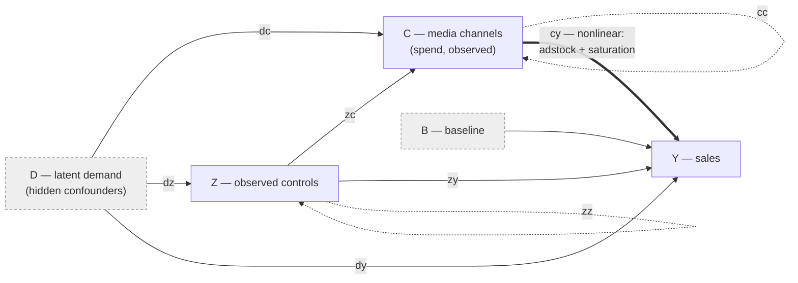

# The causal model

Every world is a **Pearlian additive structural causal model (SCM)** over five
families of nodes. The whole point of the design is the distinction between what
a modeller *observes* and what *confounds* them.

## Five node families

| Node | Symbol | Role | Observed? | Sign |
| --- | --- | --- | --- | --- |
| Latent demand | `D₁…D_J` | Hidden confounders — the classic MMM bias source | **No** | signed |
| Controls | `Z₁…Z_M` | Observed covariates (promo calendar, price, seasonality…) | Yes | signed |
| Media channels | `C₁…C_K` | The treatments / interventions; **spend is observed** | Yes | ≥ 0 |
| Baseline | `B` | Organic demand level; always feeds sales | (latent) | signed |
| Sales | `Y` | The outcome (a sink) | Yes | ≥ 0 |

In the vocabulary of the public API these are <span class="pg-pill">treatments</span>
(`n_treatments`, the channels), <span class="pg-pill">covariates</span>
(`n_covariates`, the controls), and <span class="pg-pill">latent</span> factors
(`n_latent`, the hidden confounders).

## Eight edge types

Nodes are connected by a directed acyclic graph drawn from **eight edge types**.
The type of an edge determines *where it enters* and therefore *what it does*.



| Type | Edge | Meaning | Effect on Y |
| --- | --- | --- | --- |
| `cy` | C → Y | **Direct** treatment response (carryover + saturation), coeff `βₖ` | direct |
| `dy` | D → Y | Latent-unobserved factor contributes directly to outcome | direct (non-treatment) |
| `zy` | Z → Y | Covariate contributes directly to outcome | direct (non-treatment) |
| `dc` | D → C | Latent-unobserved factor drives treatment — **confounds** attribution | indirect |
| `zc` | Z → C | Covariate drives treatment (e.g. promo triggers treatment) | indirect |
| `cc` | C → C | Treatment **halo** (upstream treatments amplify downstream) | indirect |
| `dz` | D → Z | Latent-unobserved factor moves the covariates | via Z |
| `zz` | Z → Z | Covariate chains | via Z |

## Structural equations

With `t` indexing weeks and each term gated by whether the corresponding edge
exists in the drawn DAG:

$$
\begin{aligned}
D_j &= \mathrm{RW}_j && \text{(latent-unobserved factor — a random walk)}\\[2pt]
F_m &= \mathrm{RW}_m + s_m\,\eta_{tm} + c_m\,(h_{tm} - q_m),\quad h_{tm}\sim\mathrm{Bernoulli}(q_m) && \text{(covariate's own drive)}\\[2pt]
Z_m &= \textstyle\sum_j u_{jm}\,D_j + \sum_{m'<m} \gamma_{m'm}\,Z_{m'} + F_m && \text{(covariate)}\\[2pt]
E_k &= \mathrm{RW}_k + \sigma_k\,\varepsilon_{tk} + a_k\,b_{tk},\quad b_{tk}\sim\mathrm{Bernoulli}(p_k) && \text{(treatment's own drive)}\\[2pt]
C_k &= \mathrm{softplus}\!\Big(\textstyle\sum_j w_{jk} D_j + \sum_m v_{mk} Z_m + \sum_{k'<k}\alpha_{k'k} C_{k'} + E_k\Big) && \text{(treatment — non-negative)}\\[2pt]
B &= \max(\mathrm{RW}_B,\ \texttt{baseline\_floor}) && \text{(intercept)}\\[2pt]
Y &= B + \textstyle\sum_j \delta_j D_j + \sum_m \rho_m Z_m + \sum_k g^{cy}_k\,\beta_k\, f_k(C_k) + \mathrm{RW}_Y && \text{(outcome)}
\end{aligned}
$$

Two structural facts do the heavy lifting:

1. **Only the direct `C → Y` path is nonlinear.** $f_k$ is that treatment's
   carryover ⊙ saturation response. **Every other loading is additive and linear
   on the child's pre-activation scale** — all the input→input interactions
   (`dc, zc, cc, dz, zz`) and the baseline drivers (`dy, zy`) are plain linear
   coefficients. Interaction *structure* is rich; interaction *shape* is
   linear.

    For `B`, `Z` and `Y` there is no activation, so those edges are linear on
    the *observed* scale too. A treatment is the exception: $C_k =
    \mathrm{softplus}(\cdot)$, so the observed parent→treatment mapping inherits
    the softplus curvature (and the held-level clamp, when shocks are enabled).
    With a `dc` loading of $0.308286074$ — mid-range for the default
    `dc_coeff_range=(0.1, 0.5)` — and no other parent, $D_j = -1, 0, +1$ gives
    $C = 0.5508,\ 0.6931,\ 0.8591$: two *equal* parent steps produce effects of
    $0.1423$ and $0.1660$, not one constant $0.3083$. "Linear interactions"
    means linear inside the positivity guard.
2. **Every node except `Y` carries its own random-walk noise term**, and
   treatments and covariates additionally carry high-frequency drive. For treatments —
   iid weekly
   execution noise $\sigma_k\varepsilon$ and campaign pulses $a_k b$ (a
   Bernoulli fire) — that variation is what makes treatment values *sweep* their response
   curve; without it, the contribution targets degenerate to flat lines.

    `Y` is **not** a walk. $\mathrm{RW}_Y = \texttt{rw\_y\_std}\cdot
    \varepsilon_y$ is iid Gaussian observation noise — no cumulative sum, no
    smoothing, no centring — persisted as the `outcome_noise` column, and
    `param_rw_y_std` is its exact per-week $\sigma$
    (`outcome_noise == param_rw_y_std * eps_y[carryover_burn_in:]` to the last bit).
    The signed `D` / `Z` / `B` walks are centred, smoothed Gaussian paths
    (cumulative sum → edge-padded moving average → full-path centring → a fixed
    scale divisor); a treatment's own drive is the *positive-only* version of the
    same construction — the identical signed path, wrapped in `softplus`. Their
    `param_rw_*_std` label calibrates the second moment,
    $E[\mathrm{var}_{\text{pop}}(\text{path})] = \texttt{std}^2$, i.e.
    $\texttt{std} = \sqrt{E[\mathrm{var}_{\text{pop}}]}$ — *not*
    $E[\mathrm{sd}(\text{path})] = \texttt{std}$; measured over 20 000
    unit-`std` paths, $E[\mathrm{var}_{\text{pop}}]/\texttt{std}^2$ was
    0.990–1.004 while $E[\mathrm{sd}]/\texttt{std}$ was 0.9220 at kernel width 1
    and 0.8674 at width 26. See the
    [corpus guide](corpus.md#random-walk-parameter-labels) for the persisted
    labels, including why full-path centring makes a path non-adapted without
    letting future treatment into the treatment response.

### Why covariates carry texture too

A smooth-walk-only covariate is drawn from the **same function space as the
smooth baseline walk** $\mathrm{RW}_B$. Over a typical horizon the two are
nearly collinear, so $\rho_m$ (the `Z → Y` loading) trades off against baseline
drift and is only weakly identified — an unregularised fit blows up, and a
shrinking estimator is doing the right thing on an unidentified direction.

The fix is at the source: give a covariate high-frequency content the smooth
baseline cannot mimic. That is $s_m\eta_{tm}$ (iid weekly noise) and
$c_m(h_{tm}-q_m)$ (a calendar pulse), which is also what real covariates — promos,
holidays, price steps — actually look like. Two properties matter:

- **Relative to the covariate's own walk std.** A signed covariate has no positive
  level to anchor on, so $s_m$ and $c_m$ are drawn as factors of
  $\texttt{rw\_z\_std}[m]$, which keeps them scale-free.
- **The pulse is centred** on its own fire probability, so both added terms are
  mean-zero ($E[F_m - \mathrm{RW}_m]=0$): a covariate's expected level is still
  its walk mean — **exactly**, because a covariate applies no activation — and
  the parameter-only saturation reference levels below are untouched.
  (The treatment pulse is deliberately *not* centred — a treatment is positive and
  its level may rise.)

Measured on 18 covariates over six worlds at `n_time_steps=78`: $R^2$ against a
5-term smooth cosine basis falls from a median of **0.94** (range 0.54–0.995)
to **0.64** (range 0.22–0.93), i.e. the variation that identifies $\rho_m$
grows ~6.5× at the median. Set the three `covariate_*_range` knobs to
`(0.0, 0.0)` to recover the pre-texture (smooth-walk-only) covariates exactly.

### The intercept, and what is *not* censored

`B` carries no parents. Latent-unobserved factors and covariates enter `Y` directly
through $\delta_j$ / $\rho_m$, which does two things: `Y` becomes literally the
equation a standard MMM assumes (intercept + linear covariates + nonlinear treatments
+ noise), and the intercept becomes a level worth reporting on its own. It is
persisted as `baseline_intrinsic`, with the observation noise split out into
`outcome_noise`, so the identity reads

```text
baseline_intrinsic + outcome_noise + Σ covariate_contribution
  + Σ latent_unobserved_contribution + Σ contributions
  + Σ indirect_effects_by_source == sales
```

`baseline_floor` (default `None`) censors the intercept: `B = max(RW_B, floor)`.
A censored walk — not a softplus — so `B` can sit exactly *at* the floor, which
is what a baseline that "can be zero but never negative" means. Keeping the
parents outside `B` is precisely what makes this safe: the floor clips **one**
additive term, so `covariate_contribution[:, m]` stays exactly
$g^{zy}_m \rho_m Z_{m}$ and the decomposition stays exact. Flooring a sum that
contained the parents would destroy that.

`baseline_floor_scope` decides *what* the floor clips. The default,
`"intercept"`, clips $B$ only — cheap and fully linear elsewhere, but a large
negative $\rho_m Z_m$ can still drag the non-treatment total below zero.
`"non_treatment"` clips the **running total** as each parent joins (locked order:
intercept → latent-unobserved factors → covariates), so

$$A^{(i)} = \max\!\big(A^{(i-1)} + \text{node}_i,\ \texttt{floor}\big),\qquad
\text{column}_i = A^{(i)} - A^{(i-1)}.$$

A negative covariate effect is then credited only down to the floor and the excess
is **absorbed** — "the negative effect cannot be bigger than the rest" — while
the columns still telescope exactly, so the identity is untouched. Measured on a
stress fixture: 112 negative non-treatment weeks under `"intercept"` become 0 under
`"non_treatment"`, with 111 weeks sitting exactly at the floor and identity error
1.8e-15. Where the floor does not bind, every column equals the linear split and
the persisted corpus is byte-identical. The price: a column is no longer linear
in its node where the floor binds.

!!! warning "Outcome itself is never censored — and cannot be strictly guaranteed"
    With `scope="non_treatment"` every term of the outcome **mean** is non-negative
    ($A \ge 0$, treatments $\ge 0$). What is left is the additive observation noise
    $\mathrm{RW}_Y$: symmetric and unbounded, so $P(Y<0)>0$ for *any*
    additive-Gaussian outcome. That is a property of the likelihood, not of this
    generator — strictness would need a censored observation or bounded noise,
    and either one leaves the function class an MMM (including this package's
    own [oracle](oracle.md)) can represent.

    So outcome stays uncensored and non-negativity is enforced by the
    [realism filter](#the-realism-filter), which is exact for every persisted
    world. The residual risk is negligible by construction rather than by luck:
    under the absorbing scope the outcome mean sits **88 σ** of observation noise
    above zero at its worst week over 12 worlds ($P \approx 10^{-1700}$), and a
    negative intercept week occurs in ~0.08% of weeks on the shipped prior.

    A floored intercept is also not Gaussian, so the oracle's analytic
    `latent="marginal"` mode raises for such configs; use `latent="sampled"`,
    which applies the identical clip.

## A drawn graph

Here is one graph, drawn live. Latent `D` confounds treatment through `D→C` (red)
while also affecting outcome through `D→Y` — the exact mechanism that biases
naive attribution.

```python exec="1" source="block" html="1"
from scm_docs import world, viz_html
import pymc_generator as pg

print(viz_html(pg.viz.plot_dag, world(scenario=1, seed=0)))
```

The same structure, listed as edges with their drawn coefficients:

```python exec="1" source="block" result="text"
from scm_docs import world
from pymc_generator.worlds import edges_with_coeffs, node_status

scm = world(1, 0)
for et, src, dst, coef in edges_with_coeffs(scm.g, scm.params):
    print(f"[{et}] {src:>3} -> {dst:<3}  coef = {coef:+.3f}")
print("\nnode status:", node_status(scm.g))
```

## How a world is created

A world is drawn in **two stages** — structure first (concrete, with numpy),
then parameters and noise (as a PyMC model). This mirrors the design principle:
*discrete structure is drawn per world; continuous priors are distributions.*

=== "Stage 1 — structure (concrete)"

    `sample_g_additive` + `sample_structure` fix the graph's *shape*: the active
    sizes (how many nodes are live), the DAG `g` (which of the 8 edge types
    connect which nodes), each treatment's carryover/saturation **family**, and each
    node's walk **smoothness**. `cc` and `zz` are restricted to the strict upper
    triangle (`src < dst`), which guarantees acyclicity.

    In the single-world path, the DAG is resampled until it satisfies a
    connectivity rule: **dead-end nodes are never allowed**, and fully-isolated
    null nodes are permitted (as deliberate zero-attribution traps) unless
    `connect_all=True`.

=== "Stage 2 — parameters & noise (a PyMC model)"

    `build_world_model` assembles one `pm.Model` in which **every continuous
    quantity is a random variable**: edge coefficients (`pm.Uniform`), random-walk
    means/stds and innovations, mechanism shapes, and treatment/covariate texture. Every graph
    output is a `pm.Deterministic`, so a single **`pm.draw`** returns the
    parameters, the series, and the full decomposition jointly. Candidate draws
    are run through the [realism filter](#the-realism-filter); the first accepted
    draw is kept.

Everything is driven by **one numpy RNG** seeded from `cfg.seed`, so `(cfg, seed)`
reproduces a world bit-for-bit.

## The realism filter

Every candidate draw must pass or it is rejected and redrawn — a world is only
kept if it *looks like data a modeller would actually get*:

1. **Finiteness** — every series is all-finite.
2. **Non-negative outcome** — no `outcome < 0`.
3. **Treatment-CV floor** — each active direct treatment's coefficient of variation
   ≥ `treatment_cv_floor` (default `0.08`); a treatment that never moves teaches
   nothing.
4. **Outcome spike guard** — `max(outcome) / median(outcome) < 8`.
5. **Treatment spike guard** — per treatment, `max / median < 50`.

## Assumptions in one place

These are the modeling commitments baked into the generator. They are
deliberate, and they bound what a model trained on this data can learn.

- **Additive outcome.** Outcome is a *sum* of a baseline and per-treatment
  contributions (plus noise), not a multiplicative model.
- **Linear interactions, nonlinear direct response.** Only the `C → Y` treatment
  path carries carryover and saturation; every other loading is linear on the
  child's pre-activation scale (observed-scale linear for `B`, `Z` and `Y`,
  softplus-curved for a treatment).
- **Treatment is non-negative.** Treatments pass through `softplus`.
- **Latent-unobserved factor is never observed.** `D` drives both treatments (`dc`) and the
  outcome (`dy`) — getting attribution right despite `D` is the core task.
- **Acyclicity by construction.** `C→C` and `Z→Z` live on the strict upper
  triangle.
- **κ-relative saturation.** Each curve's knee is set from a parameter-only
  **reference level** — an anchor, not $E[C_k]$:
  `softplus(softplus(rw_c_mean) + pulse_amp * pulse_prob + weighted reference
  Z→C / C→C parent terms)`. Latent `D→C` drops out because the latent-unobserved factor is mean-zero,
  and covariate texture drops out because both of its terms are mean-zero (its
  pulse is centred). The treatment softplus makes $E[C_k]$ strictly larger than
  the anchor (measured $E[C_k]/\texttt{saturation\_scale}$ 1.004–1.099); the
  anchor's value is that it reads no moment at all. The same pinned scale is
  used for every decomposition variant.
- **Carryover burn-in.** Worlds simulate `n_time_steps + carryover_burn_in` weeks and
  report the last `n_time_steps`, so the reported window sees real history.
  `carryover_burn_in` is either `0` (off — the raw `SCMPrior` default, with
  `l_max = 8`) or `≥ l_max` (`make_scm_prior` pins it to `l_max`, so the preset
  ships `8`/`8`); nothing in between.

!!! tip "Next"
    See [The exact decomposition](decomposition.md) for how outcome splits into its
    true components — and how to verify the split yourself.
